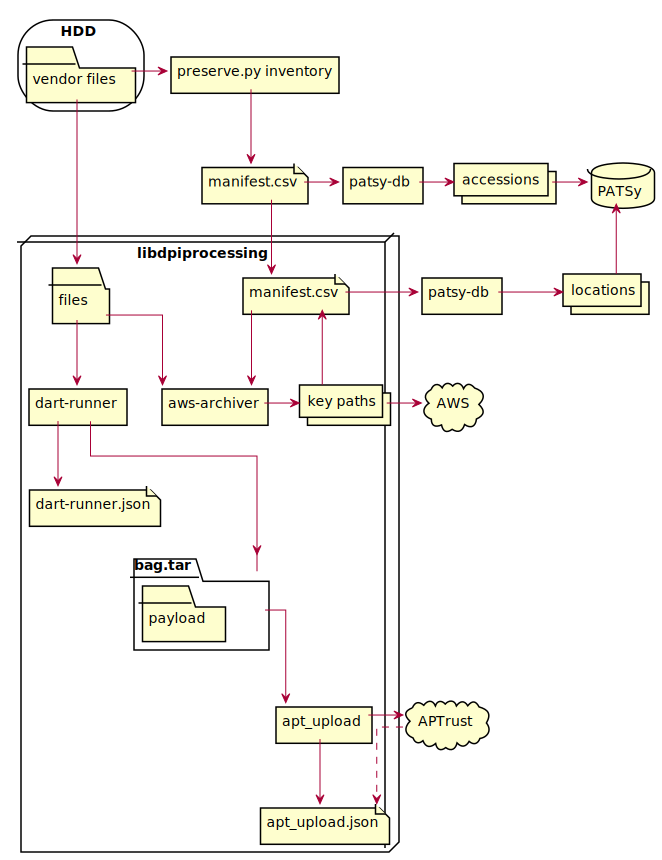

# digital-preservation-toolkit

Tools and documentation for digital preservation at University of
Maryland Libraries

## About

This repository contains documentation of the University of Maryland
Libraries' processes for digital preservation. It also uses git submodules
to include the code for preservation tools used in these processes.

## Documentation

[Architecture Decision Records](docs/adr/) record key decisions made about
this project.

### Digital Preservation Process

*Source: [docs/process.puml](docs/process.puml)*
